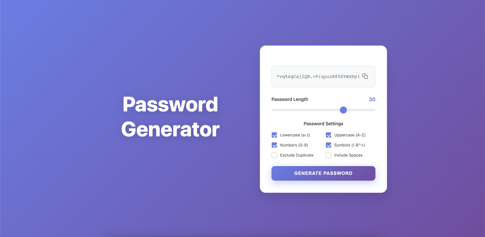

Password Generator in JavaScript

A modern, responsive password generator built with HTML, CSS, and JavaScript, designed with clean UI and powerful customization options. It allows users to generate secure passwords based on custom rules like length, character types, and duplicates — all wrapped in a beautiful, centered layout with a vibrant gradient background.

Features
•	Real-time password generation
•	Adjustable password length (6–40 characters)
•	Customizable options:
•	Lowercase letters
•	Uppercase letters
•	Numbers
•	Symbols
•	Exclude duplicate characters
•	Include spaces
•	Copy to clipboard functionality
•	Interactive slider and checkboxes
•	Fully responsive layout for all devices
•	Clean UI with modern styling and shadowed card design

    Getting Started
	1.	Clone the repository:
    git clone https://github.com/net-folade/password-generator.git
    cd password-generator

    2.	Open the index.html file in your browser:
    /path-to-project/index.html

    No additional setup or build tools required.

⸻

Technologies Used
	•	HTML5
	•	CSS3 (custom checkboxes, styled slider, responsive layout)
	•	Vanilla JavaScript (DOM manipulation, clipboard API)

⸻

Design

The project features a split-screen layout with a large heading on the left and an interactive card interface on the right. It uses a linear gradient background and subtle animations to create a smooth user experience.

⸻

Screenshot

